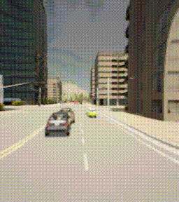

# Scene Graph Safety Monitoring (SGSM)

This repository contains the code for the paper "Specifying and Monitoring Safe Driving Properties with Scene Graphs". The code is written in Python and requires [conda](https://docs.anaconda.com/free/anaconda/install/linux/) and [7z](https://www.7-zip.org/download.html) to be installed. The code was tested using Ubuntu 20.04.

## Installation
To install everything needed to run the code, execute the following command:
```bash
./install.sh
```
The installation script will do the following:
1) Create a conda environment called 'sg_monitor'.
2) Install the python packages specified in requirements.txt.
3) Install [mona](https://www.brics.dk/mona/) using the `install_mona.sh` script

## Usage
To reproduce the results of the paper, execute the following command:
```bash
./run.sh
```
This script will do the following:
1) Activate the conda environment 'sg_monitor'.
2) Pull the images and scene graphs collected from the CARLA simulator using [TCP](https://github.com/OpenDriveLab/TCP), [Interfuser](https://github.com/opendilab/InterFuser?tab=readme-ov-file), and [LAV](https://github.com/dotchen/LAV).
3) Check the properties specified in the paper, located in the properties.py file, using the scene graphs and the SG Monitor.
4) Generate tables that show the property violations of the 3 Systems Under Test (SUTs) per Route and a Summary table that shows the total number of property violations per SUT.

## Results
| SUT             | Phi1 | Phi2 | Phi3 | Phi4_S_5 | Phi4_S_10 | Phi4_S_15 | Phi5 | Phi6 | Phi7_T_5 | Phi7_T_10 | Phi7_T_15 | Phi8_T_5 | Phi8_T_10 | Phi8_T_15 | Phi9 | Total |
|-----------------|------|------|------|----------|-----------|-----------|------|------|----------|-----------|-----------|----------|-----------|-----------|------|-------|
| Interfuser      | 3    | 0    | 10   | 0        | 0         | 0         | 3    | 9    | 10       | 5         | 5         | 10       | 5         | 5         | 7    | 72.0  |
| TCP             | 6    | 0    | 10   | 0        | 0         | 0         | 2    | 6    | 5        | 3         | 3         | 8        | 0         | 0         | 8    | 51.0  |
| LAV             | 6    | 1    | 10   | 0        | 0         | 0         | 3    | 2    | 8        | 6         | 5         | 10       | 6         | 1         | 7    | 65.0  |
| Total           | 15   | 1    | 30   | 0        | 0         | 0         | 8    | 17   | 23       | 14        | 13        | 28       | 11        | 6         | 22   | 188.0 |

## Property Violation Examples

**Property 6**: "If the Ego vehicle is moving and there is no entity in the same lane as the Ego vehicle within 7 meters, and there is no red traffic light or stop sign controlling the Ego vehicle's lane, then the Ego vehicle should not stop."​ - violated by **Interfuser**


**Property 9**: "Once the Ego vehicle detects a new stop signal controlling its lane, it must stop before passing the stop signal."​  - violated by **TCP**


**Property 7**: "If the Ego vehicle is not in a junction, then Ego vehicle cannot be in more than one lane for more than 15 seconds."​ - violated by **LAV**



## Tables

### Table 3: Intermediate variables used in Atomic Propositions 
| Name           | DSL expression                                                           |
|----------------|--------------------------------------------------------------------------|
| egoLanes       | relSet(Ego, isIn)                                                       |
| egoRoads       | relSet(egoLanes, isIn)                                                  |
| egoJunctions   | relSet(egoRoads, isIn)                                                  |
| oppLanes       | relSet(egoLanes, opposes)                                               |
| offRoad        | filterByAttr(egoLanes, kind, $\lambda x : x = \text{offRoad}$)          |
| rightLanes     | relSet(egoLanes, toRightOf)                                             |
| steerRight     | filterByAttr(Ego, steer, $\lambda x : x > 0$)                           |
| inEgoLane      | relSetR(egoLanes, isIn)\setminus \{Ego\}                                |
| nearColl       | relSet(inEgoLane, near_coll)                                            |
| superNear      | relSet(inEgoLane, super_near)                                           |
| egoFasterS     | filterByAttr(Ego, speed, $\lambda x : x > S$)                           |
| noThrottle     | filterByAttr(Ego, throttle, $\lambda x:x<\epsilon$)                     |
| tLights        | filterByAttr(G, kind, $\lambda x : x =\text{trafficLight}$)             |
| redLights      | filterByAttr(tLights, lightState, $\lambda x:x=\text{Red}$)             |
| trafLightLns   | relSet(redLights, controlsTrafficOf)                                     |
| stopSigns      | filterByAttr(G, kind, $\lambda x : x =\text{stopSign}$)                  |
| stopSignLanes  | relSet(stopSigns, controlsTrafficOf)                                     |
| egoStopped     | filterByAttr(Ego, speed, $\lambda x:x<\epsilon$)                         |
| juncRoads      | relSetR(egoJunctions, isIn)                                             |

### Table 4: Atomic Propositions
| Atomic Prop.     | DSL expression                                      |
|------------------|-----------------------------------------------------|
| isJunction       | $\|egoJunctions\|>0$                                 |
| isOppLane        | $\|oppLanes\|>0$                                     |
| isOffRoad        | $\|offRoad\|>0$                                      |
| isInRightLane    | $\|rightLanes\|=0$                                    |
| isNotSteerRight | $\|steerRight\|=0$                                    |
| isNearColl       | $\|nearColl\|>0$                                     |
| isFasterThanS    | $\|egoFasterS\|=1$                                    |
| isSuperNear      | $\|superNear\|>0$                                    |
| isNoThrottle     | $\|noThottle\|=1$                                    |
| isMultipleLanes  | $\|egoLanes\|>1$                                     |
| hasRed           | $\|trafLightLns \cap egoLanes\|>0$                    |
| hasStop          | $\|stopSignLanes \cap egoLanes\|>0$                   |
| isStopped        | $\|egoStopped\|=1$                                    |
| isOnlyJunction   | $\|egoRoads \setminus juncRoads\|=0$                  |
